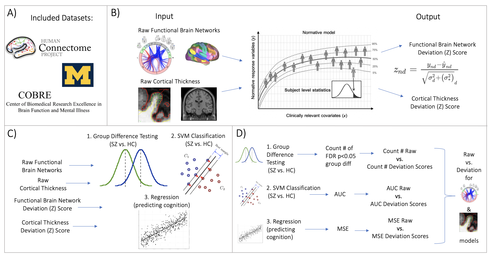

# Evidence for Embracing Normative Modeling

Analysis and visualization code for *Evidence for Embracing Normative Modeling.* Rutherford et al. (2022). Preprint [here](https://www.biorxiv.org/content/10.1101/2022.11.14.516460v1.full.pdf).

The pre-trained normative models of functional connectivity, cortical thickness, and surface area are hosted on the PCN lab GitHub [here](https://github.com/predictive-clinical-neuroscience/braincharts). These pre-trained normative models can also be accessed through the [PCNportal](https://pcnportal.dccn.nl/) website, a no code required interface for transfering big data normative models to new data sets.

The organization of the scripts in this repository is as follows:
- The evaluation metrics are visualized in EvaluationFigures.ipynb 
- The age distribution of each data set is visualized in AgeDistFig.ipynb 
- Benchmarking Task 1 and 2 (group difference testing and classification) svm_groupdiff_ct_yeo.ipynb. Data for this task are unable to be shared due to restrictions on the data sets. The notebooks are stored with all of the outputs saved. Permutations for these tasks were run using sz_groupdiff_ct.py, sz_groupdiff_yeo.py, sz_svm_ct_perms.py, and sz_svm_yeo_perms.py
- Benchmarking Task 3 (regression - predicting cognition) regression_hcp_yeo17_ct.ipynb. Data for this task are stored in numpy arrays in the `data/` folder. Permutations for this task were run using regression_hcp_ct_perms.py, and regression_hcp_yeo_perms.py
- `connectome_scripts/` contains example scripts used to create the connectomes used to train the functional normative models and an example script to vectorize the connectomes. 

**Figure 1: Overview of Workflow. A)** Datasets included the Human Connectome Project young adult study (HCP-YA), University of Michigan schizophrenia study, and COBRE schizophrenia dataset. **B)** Openly shared pre-trained on big data normative models were estimated for large scale resting state brain networks and cortical thickness. **C)** Deviation (Z) scores and raw data, for both functional and structual data, were input into three benchmarking tasks: 1.) group difference testing (SZ vs. HC), 2.) support vector machine classification (SZ vs. HC), and 3.) regression (predicting cognition). **D)** Evaluation metrics were calculated for each benchmarking task. These metrics were calculated for both the raw data and deviation score models. The difference between each models' performance was calculated for the functional and structural modalities. 
